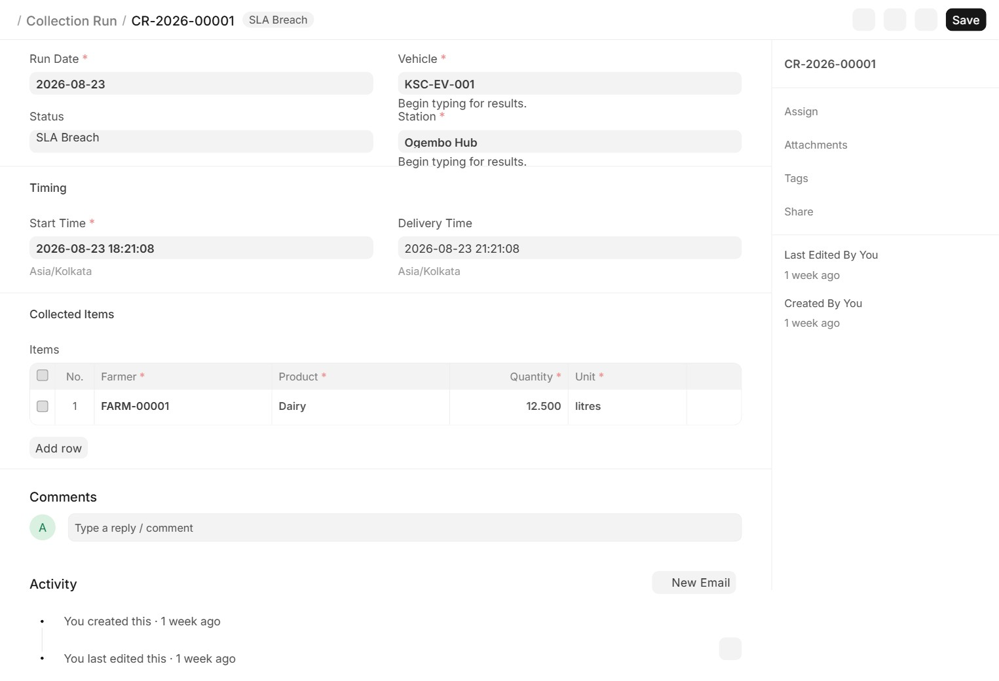
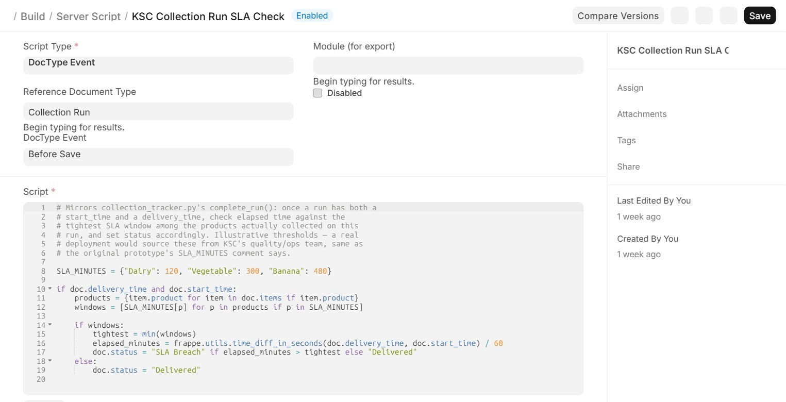

# KSC Operations (ERPNext / Frappe)

A custom Frappe app that ports the [First-Mile Collection & Fleet
Dispatch Tracker](https://github.com/cowinoochieng-web/ksc-collection-tracker)
— a standalone Flask/SQLite prototype built to understand Kisii Smart
Community's operational problem — into real ERPNext doctypes, on the
actual framework, and bridges the two systems together via a
whitelisted REST API.

## Why this exists alongside the Flask prototype

The Flask app proves the workflow logic and the general full-stack
skill set. It doesn't prove ERPNext/Frappe development specifically,
because it isn't ERPNext — it's a from-scratch tool designed to be
*easy to demo* without a provisioned Frappe/MariaDB stack. This app is
the other half: the same domain, rebuilt as customised DocTypes,
fields, and server-side scripts inside a real bench, to close that gap
with working code instead of a "self-directed, in progress" note — and
the two now actually talk to each other (see
[How it connects to the Flask dashboard](#how-it-connects-to-the-flask-dashboard)),
rather than sitting side by side as disconnected demos.

## Navigation

Fleet doctypes (`KSC Operations` module) and HR doctypes (`hrms`) ship
in separate Frappe modules by default, which by default means separate,
scattered Workspaces in the desk sidebar — six of them for HR alone
(Leaves, Shift & Attendance, Recruitment, Tenure, Performance, HR
Setup). A single custom **Fleet & HR** Workspace
(`ksc_operations/workspace/fleet_&_hr/`) consolidates the doctypes this
project actually touches — Station, Farmer, KSC Vehicle, Collection Run
on one side, Employee, Designation, Attendance, Leave Application,
Shift Type, and Holiday List on the other — into one sidebar entry, so
demoing the whole domain doesn't mean hopping between unrelated default
workspaces.

## Screenshots

A Collection Run that breached its SLA — real doctype form, real data:



The SLA-check logic as an actual Server Script inside ERPNext, not a Flask route:



## Technologies used

| Layer | Choice | Why |
|---|---|---|
| Framework | Frappe `version-16` / ERPNext `version-16` | The actual framework a Frappe-stack IT/systems role runs on, not a from-scratch imitation of it |
| HR | Frappe HR (`hrms`) | Employee-process doctypes (Attendance, Leave, Shift) were split out of core ERPNext into this separate app from v15+ — installed to link drivers to Collection Runs and enforce leave-aware scheduling |
| Language | Python 3.14 | Matches the bench's pinned runtime |
| Frontend | Frappe's desk UI, Node 24 build tooling | Standard Frappe doctype forms/list views — no custom frontend was built, since the point was proving doctype/server-script fluency, not rebuilding the desk UI |
| Data | MariaDB (via bench), Redis (cache/queue) | Frappe's standard stack, run as systemd services |
| Integration | Whitelisted REST API (`ksc_ops/api.py`), Frappe API key/secret auth, least-privilege role | Lets the companion Flask dashboard pull live data from this instance — see below |
| AI assistant | Provider-agnostic LLM client (`llm_client.py`), OpenAI/Anthropic REST, mock fallback | A read-only Q&A Page grounded in this app's own data — see [Ops Assistant](#ops-assistant-read-only-ai-qa) |
| Dev environment | WSL2 Ubuntu, pyenv, nvm | Local bench for development and this README's screenshots |

## What's in it

- **Station** — a first-mile collection hub (name, county, coordinates).
  Maps 1:1 to `hubs` in the Flask prototype's `db.py`.
- **Farmer** — name, phone, home station, value chain (Dairy / Banana
  / Vegetable).
- **KSC Vehicle** — plate/tag, Traccar device ID, home station, and a
  default driver (Link → Employee). Named `KSC Vehicle` rather than
  `Vehicle` since ERPNext's Assets module already owns that name.
- **Collection Run** — a vehicle dispatched from a station, with a
  child table of **Collection Item** rows (farmer, product, quantity,
  unit), start/delivery timestamps, a driver (auto-fetched from the
  vehicle's default driver, editable for substitutions), and a status
  field (In Progress / Delivered / SLA Breach).
- **Server Script — "KSC Collection Run SLA Check"** (`Before Save` on
  Collection Run) — ports `collection_tracker.py`'s `complete_run()`
  logic directly: once a run has both a start and delivery time, it
  checks elapsed time against the tightest SLA window among the
  products actually collected (same `SLA_MINUTES` thresholds: Dairy
  120, Vegetable 300, Banana 480), and sets the status accordingly —
  now running inside ERPNext on every save, not in a Flask route.
- **HR integration** — Employee gets a Home Station link and four
  seeded Designations (E-Trike Pilot, Station Attendant, Vehicle
  Technician, Dispatch Supervisor); every E-Trike Pilot is assigned a
  Leave policy (Annual/Sick/Compassionate), a "Field Collection Shift"
  with auto-attendance, and a Kenya public holiday list.
- **Server Script — "KSC Driver Leave Check"** (`Before Save` on
  Collection Run) — blocks saving a run if its assigned driver has an
  Approved Leave Application covering the run's date, closing the loop
  between HR leave records and operational scheduling.

`ksc_ops/setup_doctypes.py`, `ksc_ops/setup_server_script.py`, and the
patches under `ksc_ops/patches/` are what created the above — kept in
the repo as a record of *how* it was built, since with `developer_mode`
on, running them is what generated the actual `.json`/`.py`/`.js` files
that ship with the app.

## How it connects to the Flask dashboard

`ksc_ops/api.py` exposes three read-only, whitelisted REST methods —
`ping`, `get_summary`, `get_fleet_status` — that mirror the Flask
prototype's own `dashboard_data.py` response shapes, so its
**ERPNext Sync** page can pull live counts and fleet status straight
from this instance instead of the two systems living side by side.

Access is scoped, not blanket: a dedicated `KSC API Reader` role
(`desk_access=0`, read-only on exactly the four doctypes above) is
granted to a dedicated integration user, authenticated with a Frappe
API key/secret — never the Administrator account. All three methods
use `frappe.get_list()`, not `frappe.get_all()`, specifically so that
role is actually enforced rather than bypassed (see
[Challenges encountered](#challenges-encountered)).

## Ops Assistant (read-only AI Q&A)

A chat-style desk Page (**Ops Assistant** — also a shortcut on the
**Fleet & HR** Workspace above) answers natural-language questions
grounded in this app's own data: "which vehicles breached SLA this
week?", "who's on leave today?", "what vehicles do we have?". It is
strictly **read-only** — no doctype writes, no autonomous actions,
just Q&A over a context snapshot pulled with `frappe.get_list()` (not
`get_all()` — same enforcement rule as the API bridge above).

The LLM backend is **provider-agnostic** (`llm_client.py`): `OpenAIClient`
and `AnthropicClient` both call their vendor's plain REST API directly
(no SDK dependency), selected via `frappe.conf` — Frappe's own config
convention, set with `bench set-config`, never a `.env` file:

```bash
bench --site your-site set-config ksc_llm_provider openai   # or anthropic
bench --site your-site set-config ksc_llm_api_key sk-...
```

With no key configured — the state of a fresh clone — it falls back to
`MockLLMClient`: not a generic stub, but a deterministic, keyword-routed
responder that templates answers from the **same real context data** a
live model would see (actual Collection Run statuses, fleet roster,
today's approved leave), so the demo is grounded in real data even
before any API key exists. Every response is honestly labeled live vs.
mock in the UI, the same "don't imply a connection that isn't there"
principle as the ERPNext Sync page's `erp_live` flag on the Flask side.

## Installation

```bash
cd $PATH_TO_YOUR_BENCH
bench get-app https://github.com/cowinoochieng-web/ksc-ops --branch version-16
bench --site your-site install-app ksc_ops
```

Built and tested against Frappe `version-16` / ERPNext `version-16`,
Python 3.14, Node 24, on a local WSL2 Ubuntu bench.

## Challenges encountered

Renaming the vehicle doctype turned out to be the real lesson in this
build. It started life as `Vehicle`, which collides with a doctype
ERPNext's own Assets module already owns — installing broke in a way
that made the naming conflict obvious. Fixing it wasn't a single
rename:

- **`fix_vehicle.py`** deleted the stale `Vehicle` doctype and
  re-exported it correctly as `KSC Vehicle` under the `KSC Operations`
  module.
- **`fix_collection_run_link.py`** then had to separately correct
  Collection Run's `vehicle` field, whose Link target was still
  pointing at the old doctype name — renaming a doctype in Frappe
  doesn't cascade to every field that references it by name.
- **`fix_server_script.py`** corrected the Server Script's body after
  an earlier version existed but wasn't actually evaluating the SLA
  logic correctly — it took deliberately seeding one in-SLA and one
  breaching run and checking the *actual* resulting status, not just
  confirming the script existed, to catch it.

Those three scripts aren't in the repo (they were one-off fixes run
via `bench execute` and cleaned up after), but the doctype/field
structure they corrected is what ships today.

**A permission bypass in the API bridge, caught only by testing the
restricted role, not just writing it.** `ksc_ops/api.py` originally
used `frappe.get_all()`, which silently sets `ignore_permissions=True`
internally — the opposite of what a "least-privilege API reader" is
supposed to mean. It wasn't obvious from reading the code; it only
showed up when I actually logged in as the restricted integration user
and confirmed a doctype outside its role (`Employee`) should raise
`PermissionError` — it didn't. Switching every call to
`frappe.get_list()` (which does enforce permissions) fixed it, and I
re-verified the `PermissionError` actually fires before wiring the
Flask side up to it.

## What I learned

- **A doctype name is a public API the moment anything links to it.**
  The `Vehicle` → `KSC Vehicle` rename touched more than the doctype
  itself — every Link field pointing at the old name needed a
  follow-up fix. Worth checking a proposed doctype name against core
  ERPNext modules *before* building fields on top of it, not after.
- **"The script exists" and "the script works" are different claims.**
  The SLA Server Script's first version was present and enabled but
  wasn't producing correct output — only caught by seeding a
  deliberately-breaching run and checking its actual status field,
  not by confirming the script saved without error. The same lesson
  showed up again with the API bridge's permission bug above.
- **Frappe's server scripts are a legitimate place to port real
  business logic**, not just a scripting toy — the same
  `SLA_MINUTES`/tightest-window logic from the Flask prototype's
  Python function ports directly into a `Before Save` script with
  almost no translation, which says something about how close
  Frappe's scripting model is to plain Python.

## What I'd build next with real access

- A Workflow on Collection Run for the human-driven parts (dispatch →
  in-transit → received at hub) alongside the automatic SLA check,
  matching how a real ops team would actually move a run through
  hand-offs.
- Fixtures for the Server Scripts, doctypes, and HR seed data, exported
  via `bench --site your-site export-fixtures`, so a fresh install gets
  them automatically instead of needing the setup scripts run by hand.
- Extend the API bridge past read-only status: a whitelisted endpoint
  for *creating* a Collection Run from the Flask dashboard's own
  data-entry form, so a field agent's logged pickup lands directly in
  ERPNext instead of needing a separate entry step.
- A driver SLA-performance report joining Collection Run history to
  Employee, and Training/certification records (e-trike operation,
  battery safety, cold-chain handling) — natural next steps on top of
  the HR integration already in place.
